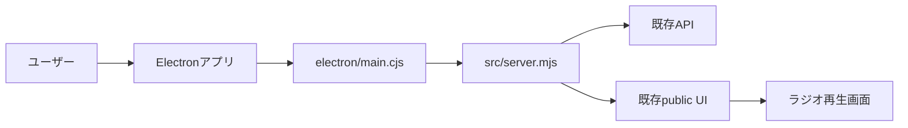

# AIゆんたくラジオ Electronアプリ化 設計書

## 目的

`projects/ai-radio` を、Windowsでダブルクリック起動できるデスクトップアプリにする。
PowerShellで `npm start` を打たなくても、専用ウィンドウからラジオ生成、再生、録音確認ができる状態を目指す。

## 方針

最初の段階では、既存のWebアプリを作り替えない。
Electronのメインプロセスから既存の `src/server.mjs` を内部起動し、Electronウィンドウで `http://127.0.0.1:<port>` を開く。

この方式なら、現在のサーバー、API、画面、TTS、ニュース取得、録音保存をそのまま使える。

## 完了条件

- `npm run app` でデスクトップウィンドウが開く
- ユーザーが別でPowerShellサーバーを起動しなくてよい
- Electronアプリを閉じたら内部サーバーも止まる
- 既存のブラウザ画面と同じ操作ができる
- 既存テストが通る
- Electron起動用の最低限のテストがある

## 対象外

初回実装では次はやらない。

- インストーラー作成
- コード署名
- 自動更新
- タスクトレイ常駐
- 複数ウィンドウ対応
- 外部公開用のセキュリティ強化

## アーキテクチャ

## ファイル構成

- `electron/main.cjs`
  - Electronのエントリーポイント。
  - 内部サーバーを起動し、準備ができたらウィンドウを開く。
  - アプリ終了時にサーバーを閉じる。

- `electron/server-runner.cjs`
  - Nodeの子プロセスで `src/server.mjs` を起動する小さな管理モジュール。
  - 起動URL、停止処理、エラー処理をまとめる。

- `test/electron-server-runner.test.mjs`
  - サーバー起動コマンドの組み立てと停止処理を確認する。
  - 実際のAI APIは呼ばない。

- `package.json`
  - `npm run app` を追加する。
  - `electron` をdevDependencyに追加する。

## データと環境変数

`.env` は今と同じくリポジトリルートのものを読む。
Electron化しても `ANTHROPIC_API_KEY` と `XAI_API_KEY` は必要。

録音、音声、BGM、メモリーは引き続き `projects/ai-radio/data` 配下に保存する。

## エラー表示

内部サーバー起動に失敗した場合は、Electronウィンドウを開く前にエラー画面またはダイアログを出す。
初回はシンプルに `dialog.showErrorBox` でよい。

## テスト方針

- 既存の `npm test` を維持する
- Electronの起動そのものは重いので、最初はサーバー起動管理の純粋関数と停止処理をテストする
- 手動確認として `npm run app` でウィンドウ起動、終了時にプロセスが残らないことを確認する
